## hueniversitypy

 [](https://codecov.io/gh/UBC-MDS/hueniversitypy) 

[](https://hueniversitypy.readthedocs.io/en/latest/?badge=latest)

Python package for creating visualizations in line with visual identities of Canadian universities

### Summary

A visual identity allows an organization to be instantly recognizable. Comprised of their logo, typeface, and colours, it is applied when creating external and internal communications. At universities, staff create visualizations that adhere to the colour palette specified by their institution's visual identity guidelines. For example, on the [*Students and Alumni*](https://masterdatascience.ubc.ca/why-ubc/students-alumni) page of UBC Master of Data Science website, the visualizations all adhere to the colour palette specified by UBC's visual identity guideline. 

This Python package allows users to apply university-specific themes to altair plots. This package currently supports the official colour palettes of four institutions belonging to the U15 Group of Canadian Research Universities: University of Alberta, the University of British Columbia, McGill University, and the University of Toronto. In the future, we hope to extend this package to support the visual identities of all universities in the association.

### hueniversitypy in the Python ecosystem

The hueniversitypy package fits into the Python ecosystem alongisde other Python packages that allow users to change the theme of plot objects. This package is different from others as it utilizes the altair visualization package rather than other types of visualization packages. Currently, there are very few packages in the Python ecosystem that apply themes to altair plots, as described in this [GitHub issue]( https://github.com/altair-viz/altair/issues/1333). One package that is designed to change the theme of altair plots for the Los Angeles Times publications can be found [here](https://github.com/datadesk/altair-latimes). Our package will be different as the goal of the change in plot theme is to adhere to certain university visual identities, rather than the Los Angeles Times colour theme.  

### Installation:

```
pip install -i https://test.pypi.org/simple/ hueniversitypy
```

### Features
- `theme_alberta()` - creates visualizations in line with [the University of Alberta's visual identity](https://www.ualberta.ca/toolkit/visual-identity/our-colours)
- `theme_mcgill()` - creates visualizations in line with [McGill University's visual identity](https://mcgill.ca/visual-identity/visual-identity-guide#mcgilllogo)
- `theme_toronto()` - creates visualizations in line with [the University of Toronto's visual identity](https://www.utm.utoronto.ca/communications/sites/files/communications/public/shared/UofT%20Style%20Guide%20%2B%20Boundless%20Guide%20Feb%202012.pdf)
- `theme_ubc()` - creates visualizations in line with [the University of British Columbia's visual identity](https://brand.ubc.ca/guidelines/downloads/ubc-colour-and-fonts/)

### Dependencies

- pandas==0.24.2
- altair==3.2.0 

### Usage

Start by importing the following packages:

```
import hueniversitypy
import altair as alt
import pandas as pd
import numpy as np
from vega_datasets import data
```
```
# Modified sample code from Altair docs 

cars = data.cars()

scatterplot = (alt
         .Chart(cars)
         .mark_circle(size=60, opacity=0.5)
         .encode(x='Horsepower',
                 y='Miles_per_Gallon',
                 color='Origin'
                )
        ).properties(width=400, height=400)

barley = data.barley()

barplot = (alt
         .Chart(barley)
         .mark_bar()
         .encode(
             x='year:O',
             y='sum(yield):Q',
             color='year:N',
             column='site:N'
         )
        )
```

### `theme_alberta()`

Available palette:

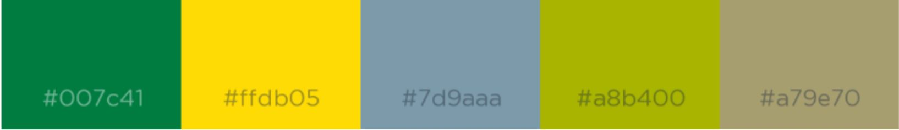

Output:

  - No direct output, however for every subsequent altair object in the script or .ipynb file the theme will be in line with [the University of Alberta’s visual identity](https://www.ualberta.ca/toolkit/visual-identity/our-colours)

```
alt.themes.register("theme_alberta", theme_alberta)
alt.themes.enable("theme_alberta")

scatterplot
```
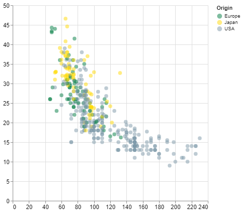

```
barplot
```
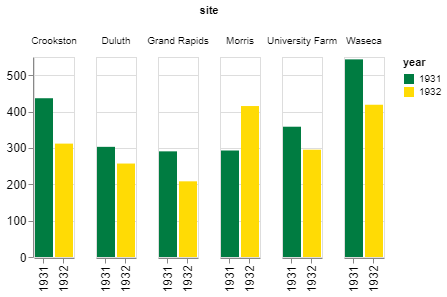

### `theme_mcgill()`

Available palette:

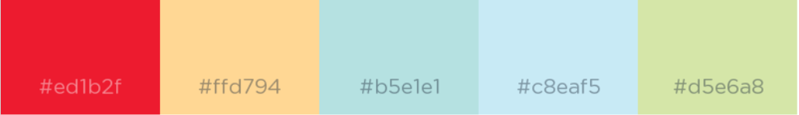

Output:

  - No direct output, however for every subsequent altair object in the script or .ipynb file the theme will be in line with [McGill University’s visual identity](https://mcgill.ca/visual-identity/visual-identity-guide#mcgilllogo)

```
alt.themes.register("theme_mcgill", theme_mcgill)
alt.themes.enable("theme_mcgill")

scatterplot
```
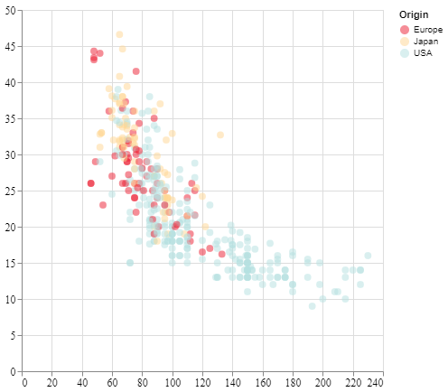

```
barplot
```
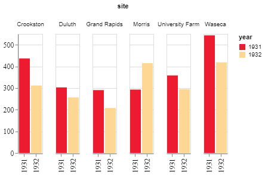

### `theme_toronto()`

Available palette:

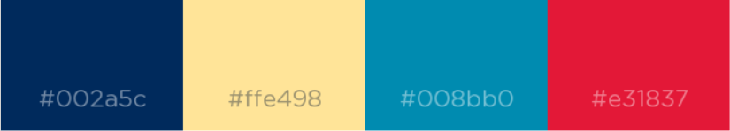

Output:

  - No direct output, however for every subsequent altair object in the script or .ipynb file the theme will be in line with [the University of Toronto’s visual identity](https://www.utm.utoronto.ca/communications/sites/files/communications/public/shared/UofT%20Style%20Guide%20%2B%20Boundless%20Guide%20Feb%202012.pdf)

```
alt.themes.register("theme_toronto", theme_toronto)
alt.themes.enable("theme_toronto")

scatterplot
```
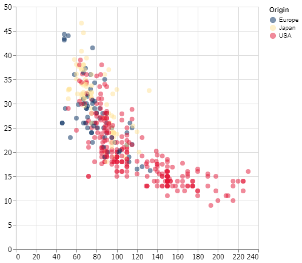

```
barplot
```
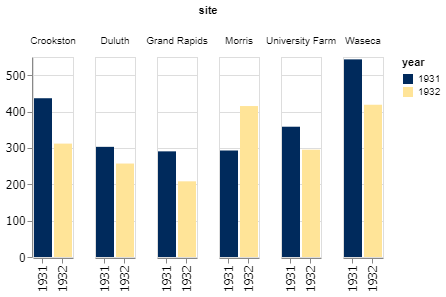

### `theme_ubc()`

Available palette:


Output:

- No direct output, however for every subsequent altair object in the script or .ipynb file the theme will be in line with [the University of British Columbia’s visual identity](https://brand.ubc.ca/guidelines/downloads/ubc-colour-and-fonts/)

```
alt.themes.register("theme_ubc", theme_ubc)
alt.themes.enable("theme_ubc")

scatterplot
```
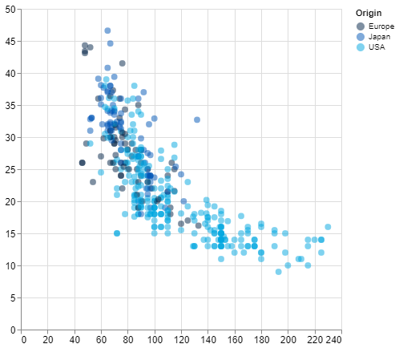

```
barplot
```
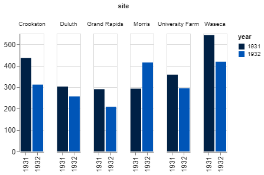


### Documentation
The official documentation is hosted on Read the Docs: <https://hueniversitypy.readthedocs.io/en/latest/>

### Credits
This package was created with Cookiecutter and the UBC-MDS/cookiecutter-ubc-mds project template, modified from the [pyOpenSci/cookiecutter-pyopensci](https://github.com/pyOpenSci/cookiecutter-pyopensci) project template and the [audreyr/cookiecutter-pypackage](https://github.com/audreyr/cookiecutter-pypackage).
